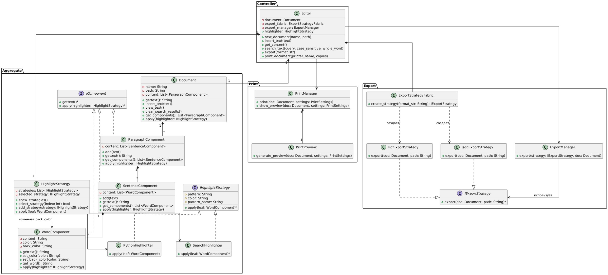

```
@startuml
skinparam linetype ortho

namespace Controller {
  class Editor {
      -document: Document
      -export_fabric: ExportStrategyFabric
      -export_manager: ExportManager
      +new_document(name, path)
      +insert_text(text)
      +get_content()
      +search_text(query, case_sensitive, whole_word)
      +export(format_str)
      +print_document(printer_name, copies)
      +highlighter: HighlightStrategy
  }
}

namespace Aggregate {
  class Document {
      -name: String
      -path: String
      -content: List<ParagraphComponent>
      +gettext(): String
      +insert_text(text)
      +view_text()
      +clear_search_results()
      +get_components(): List<ParagraphComponent>
      +apply(highlighter: IHighlightStrategy)
  }

  interface IComponent {
      +gettext()*
      +apply(highlighter: IHighlightStrategy)*
  }

  class ParagraphComponent {
      -content: List<SentenceComponent>
      +add(text)
      +gettext(): String
      +get_components(): List<SentenceComponent>
      +apply(highlighter: IHighlightStrategy)
  }

  class SentenceComponent {
      -content: List<WordComponent>
      +add(text)
      +gettext(): String
      +get_components(): List<WordComponent>
      +apply(highlighter: IHighlightStrategy)
  }

  class WordComponent {
      -content: String
      -color: String
      -back_color: String
      +gettext(): String
      +set_color(color: String)
      +set_back_color(color: String)
      +get_word(): String
      +apply(highlighter: IHighlightStrategy)
  }
  
  class SearchHighlighter {
    /'-search_query: String'/
    /'-is_case_sensitive: Boolean'/
    /'-is_whole_word: Boolean'/
    /'-target: String'/
    /'+visit_leaf(leaf: WordComponent)'/
    +apply(leaf: WordComponent)*
  }
  
  interface IHighlightStrategy {
    #pattern: String
    #color: String
    #pattern_name: String
    +apply(leaf: WordComponent)*
  }
  
  class HighlightStrategy {
    -strategies: List<IHighlightStrategy>
    -selected_strategy: IHighlightStrategy
    +show_strategies()
    +select_strategy(index: int) bool
    +add_strategy(strategy: IHighlightStrategy)
    +apply(leaf: WordComponent)
  }
  
  class PythonHighlighter {
    +apply(leaf: WordComponent)
  }
}

namespace Export {
    class ExportManager {
        +export(strategy: IExportStrategy, doc: Document)
    }
    class ExportStrategyFabric {
        +create_strategy(format_str: String): IExportStrategy
    }
    class PdfExportStrategy {
        +export(doc: Document, path: String)
    }
    class JsonExportStrategy {
        +export(doc: Document, path: String)
    }
    interface IExportStrategy {
        +export(doc: Document, path: String)*
    }
}

namespace Print {
    class PrintPreview {
        +generate_preview(doc: Document, settings: PrintSettings)
    }
    class PrintManager {
        +print(doc: Document, settings: PrintSettings)
        +show_preview(doc: Document, settings: PrintSettings)
    }
}

' Relations
Controller.Editor "1" *-- "1" Aggregate.Document
Controller.Editor --> Print.PrintManager
Controller.Editor --> Export.ExportManager
Controller.Editor *-- Export.ExportStrategyFabric

Export.ExportStrategyFabric ..> Export.PdfExportStrategy : "создаёт"
Export.ExportStrategyFabric ..> Export.JsonExportStrategy : "создаёт"
Export.ExportManager --> Export.IExportStrategy : "использует"
Export.PdfExportStrategy ..|> Export.IExportStrategy
Export.JsonExportStrategy ..|> Export.IExportStrategy

Aggregate.Document "1" *-- "*" Aggregate.ParagraphComponent
Aggregate.IComponent <|.. Aggregate.ParagraphComponent
Aggregate.IComponent <|.. Aggregate.SentenceComponent
Aggregate.IComponent <|.. Aggregate.WordComponent

Aggregate.ParagraphComponent "1" *-- "*" Aggregate.SentenceComponent
Aggregate.SentenceComponent "1" *-- "*" Aggregate.WordComponent

Print.PrintManager "1" *-- "1" Print.PrintPreview

HighlightStrategy ..> Aggregate.WordComponent : "изменяет back_color"

IHighlightStrategy <|.. PythonHighlighter
IHighlightStrategy <|.. SearchHighlighter
Editor "1" *-- "*" HighlightStrategy
HighlightStrategy --> SearchHighlighter
HighlightStrategy --> PythonHighlighter

@enduml
```