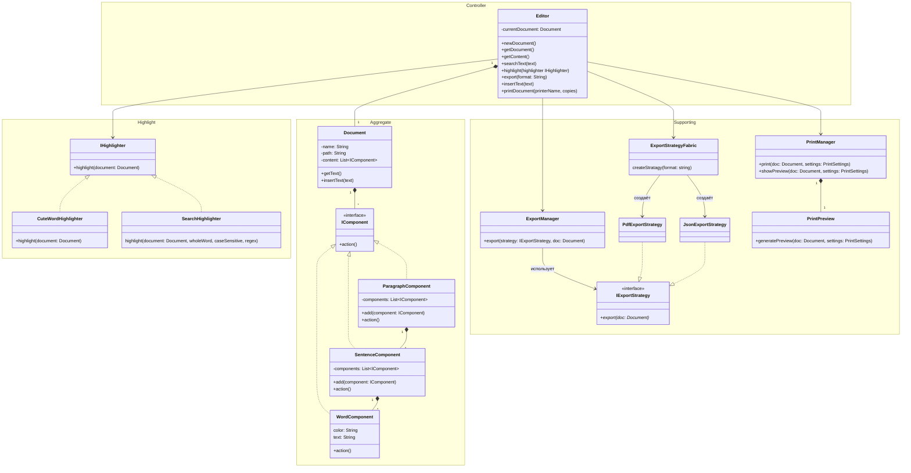

```mermaid
classDiagram
direction TB

namespace Controller {
  class Editor {
      -currentDocument: Document
      +newDocument()
      +getDocument()
      +getContent()
      +searchText(text)
      +highlight(highlighter IHighlighter)
      +export(format: String)
      +insertText(text)
      +printDocument(printerName, copies)
  }
}

namespace Highlight{
  class IHighlighter{
    +highlight(document: Document)
  }
  class CuteWordHighlighter{
    +highlight(document: Document)
  }
  class SearchHighlighter{
    highlight(document: Document, wholeWord, caseSensitive, regex)  
  }
}

namespace Aggregate {
  class Document {
      -name: String
      -path: String
      -content: List~IComponent~
      +getText()
      +insertText(text)
  }

  class IComponent {
      <<interface>>
      +action()
  }

  class ParagraphComponent {
      -components: List~IComponent~
      +add(component: IComponent)
      +action()
  }

  class SentenceComponent {
      -components: List~IComponent~
      +add(component: IComponent)
      +action()
  }

  class WordComponent {
      +action()
      color: String
      text: String
  }
}

namespace Supporting {

    class ExportManager {
        +export(strategy: IExportStrategy, doc: Document)
    }
    
    class ExportStrategyFabric{
        createStratagy(format: string)
    }

    class PdfExportStrategy {
    }
    
    class JsonExportStrategy {
    }
  
    class IExportStrategy {
        <<interface>>
        +export(doc: Document)*
    }
    


  class PrintPreview {
      +generatePreview(doc: Document, settings: PrintSettings)
  }

  class PrintManager {
      +print(doc: Document, settings: PrintSettings)
      +showPreview(doc: Document, settings: PrintSettings)
  }
}

Editor "1" *-- "1" Document
Editor --> PrintManager
Editor --> ExportManager
Editor --> ExportStrategyFabric

ExportStrategyFabric --> PdfExportStrategy : создаёт
ExportStrategyFabric --> JsonExportStrategy : создаёт

ExportManager --> IExportStrategy : использует
PdfExportStrategy ..|> IExportStrategy
JsonExportStrategy ..|> IExportStrategy

Document "1" *-- "*" IComponent
IComponent <|.. ParagraphComponent
IComponent <|.. SentenceComponent
IComponent <|.. WordComponent

ParagraphComponent "1" *-- "*" SentenceComponent
SentenceComponent "1" *-- "*" WordComponent


PrintManager "1" *-- "1" PrintPreview

IHighlighter  <|.. SearchHighlighter
IHighlighter  <|.. CuteWordHighlighter
Editor --> IHighlighter
```
```
