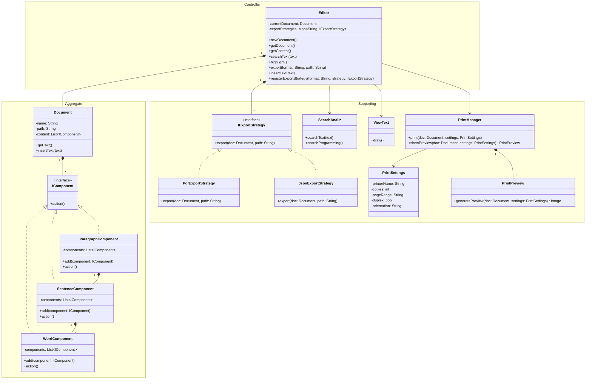

```mermaid
classDiagram
direction TB

namespace Controller {
  class Editor {
      -currentDocument: Document
      -exportStrategies: Map~String, IExportStrategy~
      +newDocument()
      +getDocument()
      +getContent()
      +searchText(text)
      +highlight()
      +export(format: String, path: String)
      +insertText(text)
      +registerExportStrategy(format: String, strategy: IExportStrategy)
  }
}

namespace Aggregate {
  class Document {
      -name: String
      -path: String
      -content: List~IComponent~
      +getText()
      +insertText(text)
  }

  class IComponent {
      <<interface>>
      +action()
  }

  class ParagraphComponent {
      -components: List~IComponent~
      +add(component: IComponent)
      +action()
  }

  class SentenceComponent {
      -components: List~IComponent~
      +add(component: IComponent)
      +action()
  }

  class WordComponent {
      -components: List~IComponent~
      +add(component: IComponent)
      +action()
  }
}

namespace Supporting {
  class IExportStrategy {
      <<interface>>
      +export(doc: Document, path: String)
  }

  class PdfExportStrategy {
      +export(doc: Document, path: String)
  }

  class JsonExportStrategy {
      +export(doc: Document, path: String)
  }

  class SearchAnaliz {
      +searchText(text)
      +searchProgramming()
  }

  class ViewText {
      +draw()
  }

  class PrintSettings {
      -printerName: String
      -copies: int
      -pageRange: String
      -duplex: bool
      -orientation: String
  }

  class PrintPreview {
      +generatePreview(doc: Document, settings: PrintSettings) Image
  }

  class PrintManager {
      +print(doc: Document, settings: PrintSettings)
      +showPreview(doc: Document, settings: PrintSettings) PrintPreview
  }
}

Editor "1" *-- "1" Document
Editor --> SearchAnaliz
Editor --> ViewText
Editor --> PrintManager
Editor "1" *-- "*" IExportStrategy

Document "1" *-- "*" IComponent
IComponent <|.. ParagraphComponent
IComponent <|.. SentenceComponent
IComponent <|.. WordComponent

ParagraphComponent "1" *-- "*" SentenceComponent
SentenceComponent "1" *-- "*" WordComponent

IExportStrategy <|.. PdfExportStrategy
IExportStrategy <|.. JsonExportStrategy

PrintManager --> PrintSettings
PrintManager "1" *-- "1" PrintPreview
```