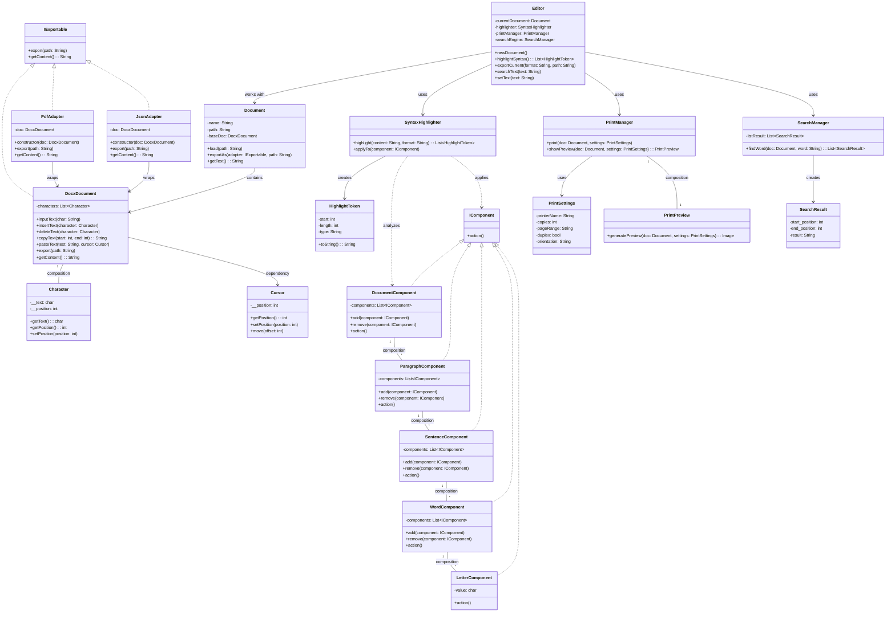

```mermaid
classDiagram
  class IComponent {
    +action()
  }

  class IExportable {
    +export(path: String)
    +getContent(): String
  }

  class DocumentComponent {
    -components: List~IComponent~
    +add(component: IComponent)
    +remove(component: IComponent)
    +action()
  }

  class ParagraphComponent {
    -components: List~IComponent~
    +add(component: IComponent)
    +remove(component: IComponent)
    +action()
  }

  class SentenceComponent {
    -components: List~IComponent~
    +add(component: IComponent)
    +remove(component: IComponent)
    +action()
  }

  class WordComponent {
    -components: List~IComponent~
    +add(component: IComponent)
    +remove(component: IComponent)
    +action()
  }

  class LetterComponent {
    -value: char
    +action()
  }

  IComponent <|.. DocumentComponent
  IComponent <|.. ParagraphComponent
  IComponent <|.. SentenceComponent
  IComponent <|.. WordComponent
  IComponent <|.. LetterComponent

  DocumentComponent "1" -- "*" ParagraphComponent : composition
  ParagraphComponent "1" -- "*" SentenceComponent : composition
  SentenceComponent "1" -- "*" WordComponent : composition
  WordComponent "1" -- "*" LetterComponent : composition

  class Document {
    -name: String
    -path: String
    -baseDoc: DocxDocument
    +load(path: String)
    +exportAs(adapter: IExportable, path: String)
    +getText(): String
  }

  class DocxDocument {
    -characters: List~Character~
    +inputText(char: String)
    +insertText(character: Character)
    +deleteText(character: Character)
    +copyText(start: int, end: int): String
    +pasteText(text: String, cursor: Cursor)
    +export(path: String)
    +getContent(): String
  }

  class PdfAdapter {
    -doc: DocxDocument
    +constructor(doc: DocxDocument)
    +export(path: String)
    +getContent(): String
  }

  class JsonAdapter {
    -doc: DocxDocument
    +constructor(doc: DocxDocument)
    +export(path: String)
    +getContent(): String
  }

  class Cursor {
    -__position: int
    +getPosition(): int
    +setPosition(position: int)
    +move(offset: int)
  }

  class Character {
    -__text: char
    -__position: int
    +getText(): char
    +getPosition(): int
    +setPosition(position: int)
  }

  IExportable <|.. DocxDocument
  IExportable <|.. PdfAdapter
  IExportable <|.. JsonAdapter

  PdfAdapter --> DocxDocument : wraps
  JsonAdapter --> DocxDocument : wraps
  Document --> DocxDocument : contains
  DocxDocument "1" -- "*" Character : composition
  DocxDocument --> Cursor : dependency

  class SyntaxHighlighter {
    +highlight(content: String, format: String): List~HighlightToken~
    +applyTo(component: IComponent)
  }

  class HighlightToken {
    -start: int
    -length: int
    -type: String
    +toString(): String
  }

  SyntaxHighlighter --> HighlightToken : creates
  SyntaxHighlighter ..> DocumentComponent : analyzes
  SyntaxHighlighter ..> IComponent : applies

  class SearchManager {
    -listResult: List~SearchResult~
    +findWord(doc: Document, word: String): List~SearchResult~
  }

  class SearchResult {
    -start_position: int
    -end_position: int
    -result: String
  }

  SearchManager --> SearchResult : creates

  class PrintSettings {
    -printerName: String
    -copies: int
    -pageRange: String
    -duplex: bool
    -orientation: String
  }

  class PrintPreview {
    +generatePreview(doc: Document, settings: PrintSettings): Image
  }

  class PrintManager {
    +print(doc: Document, settings: PrintSettings)
    +showPreview(doc: Document, settings: PrintSettings): PrintPreview
  }

  PrintManager --> PrintSettings : uses
  PrintManager "1" -- "1" PrintPreview : composition

  class Editor {
    -currentDocument: Document
    -highlighter: SyntaxHighlighter
    -printManager: PrintManager
    -searchEngine: SearchManager
    +newDocument()
    +highlightSyntax(): List~HighlightToken~
    +exportCurrent(format: String, path: String)
    +searchText(text: String)
    +setText(text: String)
  }

  Editor --> Document : works with
  Editor --> SyntaxHighlighter : uses
  Editor --> PrintManager : uses
  Editor --> SearchManager : uses

```