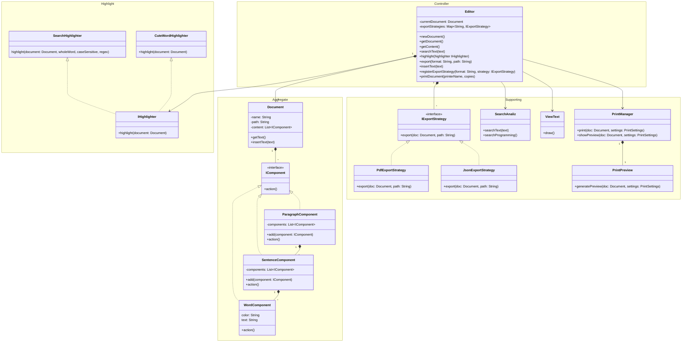

```mermaid
classDiagram
direction TB

namespace Controller {
  class Editor {
      -currentDocument: Document
      -exportStrategies: Map~String, IExportStrategy~
      +newDocument()
      +getDocument()
      +getContent()
      +searchText(text)
      +highlight(highlighter IHighlighter)
      +export(format: String, path: String)
      +insertText(text)
      +registerExportStrategy(format: String, strategy: IExportStrategy)
      +printDocument(printerName, copies)
  }
}

namespace Highlight{
  class IHighlighter{
    +highlight(document: Document)
  }
  class CuteWordHighlighter{
    +highlight(document: Document)
  }
  class SearchHighlighter{
    highlight(document: Document, wholeWord, caseSensitive, regex)  
  }
}

namespace Aggregate {
  class Document {
      -name: String
      -path: String
      -content: List~IComponent~
      +getText()
      +insertText(text)
  }

  class IComponent {
      <<interface>>
      +action()
  }

  class ParagraphComponent {
      -components: List~IComponent~
      +add(component: IComponent)
      +action()
  }

  class SentenceComponent {
      -components: List~IComponent~
      +add(component: IComponent)
      +action()
  }

  class WordComponent {
      +action()
      color: String
      text: String
  }
}

namespace Supporting {
  class IExportStrategy {
      <<interface>>
      +export(doc: Document, path: String)
  }

  class PdfExportStrategy {
      +export(doc: Document, path: String)
  }

  class JsonExportStrategy {
      +export(doc: Document, path: String)
  }

  class SearchAnaliz {
      +searchText(text)
      +searchProgramming()
  }

  class ViewText {
      +draw()
  }

  class PrintPreview {
      +generatePreview(doc: Document, settings: PrintSettings)
  }

  class PrintManager {
      +print(doc: Document, settings: PrintSettings)
      +showPreview(doc: Document, settings: PrintSettings)
  }
}

Editor "1" *-- "1" Document
Editor --> SearchAnaliz
Editor --> ViewText
Editor --> PrintManager
Editor "1" *-- "*" IExportStrategy

Document "1" *-- "*" IComponent
IComponent <|.. ParagraphComponent
IComponent <|.. SentenceComponent
IComponent <|.. WordComponent

ParagraphComponent "1" *-- "*" SentenceComponent
SentenceComponent "1" *-- "*" WordComponent

IExportStrategy <|.. PdfExportStrategy
IExportStrategy <|.. JsonExportStrategy

PrintManager "1" *-- "1" PrintPreview

SearchHighlighter <|.. IHighlighter
CuteWordHighlighter <|.. IHighlighter
Editor --> IHighlighter
```
