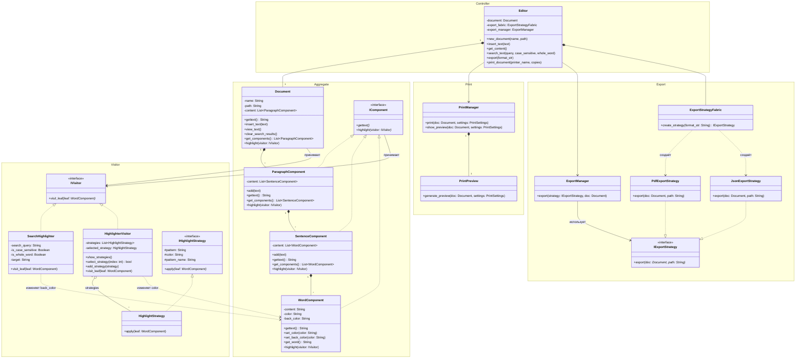

```mermaid
classDiagram
direction TB

namespace Controller {
  class Editor {
      -document: Document
      -export_fabric: ExportStrategyFabric
      -export_manager: ExportManager
      +new_document(name, path)
      +insert_text(text)
      +get_content()
      +search_text(query, case_sensitive, whole_word)
      +export(format_str)
      +print_document(printer_name, copies)
  }
}

namespace Visitor {
  class IVisitor {
    <<interface>>
    +visit_leaf(leaf: WordComponent)*
  }
  
  class SearchHighlighter {
    -search_query: String
    -is_case_sensitive: Boolean
    -is_whole_word: Boolean
    -target: String
    +visit_leaf(leaf: WordComponent)
  }
  
  class HighlighterVisitor {
    -strategies: List~HighlightStrategy~
    -selected_strategy: HighlightStrategy
    +show_strategies()
    +select_strategy(index: int) bool
    +add_strategy(strategy)
    +visit_leaf(leaf: WordComponent)
  }
  
  class IHighlightStrategy {
    <<interface>>
    #pattern: String
    #color: String
    #pattern_name: String
    +apply(leaf: WordComponent)*
  }
  
  class HighlightStrategy {
    +apply(leaf: WordComponent)
  }
}

namespace Aggregate {
  class Document {
      -name: String
      -path: String
      -content: List~ParagraphComponent~
      +gettext() String
      +insert_text(text)
      +view_text()
      +clear_search_results()
      +get_components() List~ParagraphComponent~
      +highlight(visitor: IVisitor)
  }

  class IComponent {
      <<interface>>
      +gettext()*
      +highlight(visitor: IVisitor)*
  }

  class ParagraphComponent {
      -content: List~SentenceComponent~
      +add(text)
      +gettext() String
      +get_components() List~SentenceComponent~
      +highlight(visitor: IVisitor)
  }

  class SentenceComponent {
      -content: List~WordComponent~
      +add(text)
      +gettext() String
      +get_components() List~WordComponent~
      +highlight(visitor: IVisitor)
  }

  class WordComponent {
      -content: String
      -color: String
      -back_color: String
      +gettext() String
      +set_color(color: String)
      +set_back_color(color: String)
      +get_word() String
      +highlight(visitor: IVisitor)
  }
}

namespace Export {
    class ExportManager {
        +export(strategy: IExportStrategy, doc: Document)
    }
    class ExportStrategyFabric {
        +create_strategy(format_str: String) IExportStrategy
    }
    class PdfExportStrategy {
        +export(doc: Document, path: String)
    }
    class JsonExportStrategy {
        +export(doc: Document, path: String)
    }
    class IExportStrategy {
        <<interface>>
        +export(doc: Document, path: String)*
    }
}

namespace Print {
    class PrintPreview {
        +generate_preview(doc: Document, settings: PrintSettings)
    }
    class PrintManager {
        +print(doc: Document, settings: PrintSettings)
        +show_preview(doc: Document, settings: PrintSettings)
    }
}

Editor "1" *-- "1" Document
Editor --> PrintManager
Editor --> ExportManager
Editor *-- ExportStrategyFabric

ExportStrategyFabric ..> PdfExportStrategy : создаёт
ExportStrategyFabric ..> JsonExportStrategy : создаёт
ExportManager --> IExportStrategy : использует
PdfExportStrategy ..|> IExportStrategy
JsonExportStrategy ..|> IExportStrategy

Document "1" *-- "*" ParagraphComponent
IComponent <|.. ParagraphComponent
IComponent <|.. SentenceComponent
IComponent <|.. WordComponent

ParagraphComponent "1" *-- "*" SentenceComponent
SentenceComponent "1" *-- "*" WordComponent

PrintManager "1" *-- "1" PrintPreview

IVisitor <|.. SearchHighlighter
IVisitor <|.. HighlighterVisitor

SearchHighlighter ..> WordComponent : изменяет back_color

IHighlightStrategy <|.. HighlightStrategy
HighlighterVisitor "1" o-- "*" HighlightStrategy : strategies
HighlighterVisitor ..> WordComponent : изменяет color

Document --> IVisitor : принимает
IComponent --> IVisitor : принимает
```