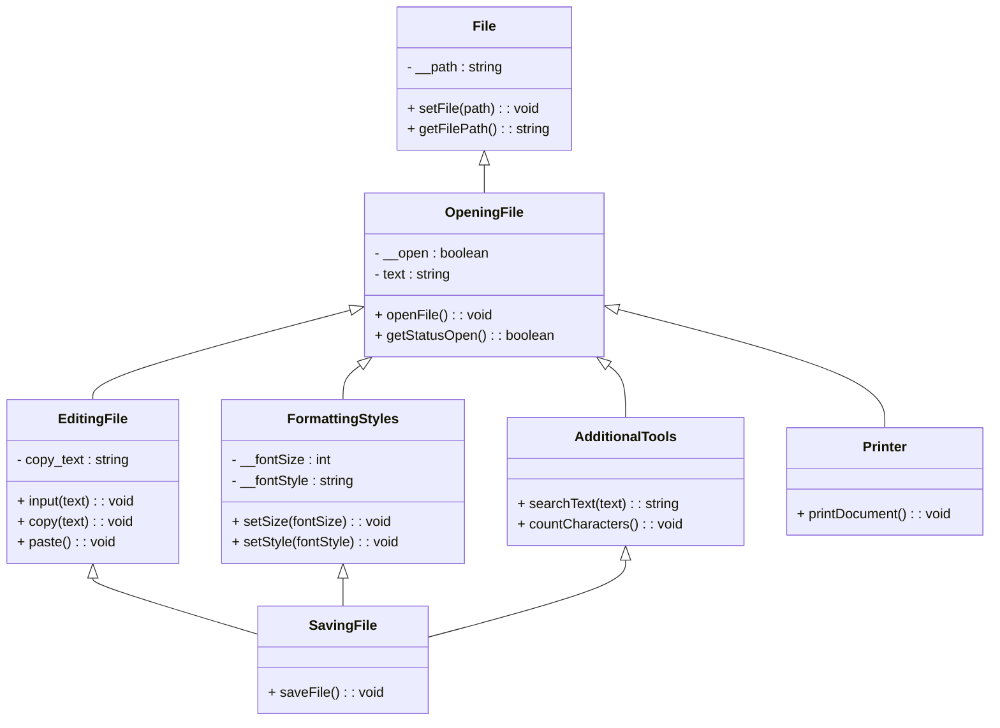

# Диаграмма классов

```mermaid
classDiagram
  class File {
    - __path : string
    + setFile(path) : void
    + getFilePath() : string
  }

  class OpeningFile {
    - __open : boolean
    - text : string
    + openFile() : void
    + getStatusOpen() : boolean
  }
  File <|-- OpeningFile

  class EditingFile {
    - copy_text : string
    + input(text) : void
    + copy(text) : void
    + paste() : void
  }
  OpeningFile <|-- EditingFile

  class FormattingStyles {
    - __fontSize : int
    - __fontStyle : string
    + setSize(fontSize) : void
    + setStyle(fontStyle) : void
  }
  OpeningFile <|-- FormattingStyles

  class AdditionalTools {
    + searchText(text) : string
    + countCharacters() : void
  }
  OpeningFile <|-- AdditionalTools

  class Printer {
    + printDocument() : void
  }
  OpeningFile <|-- Printer

  class SavingFile {
    + saveFile() : void
  }
  EditingFile <|-- SavingFile
  FormattingStyles <|-- SavingFile
  AdditionalTools <|-- SavingFile
```
