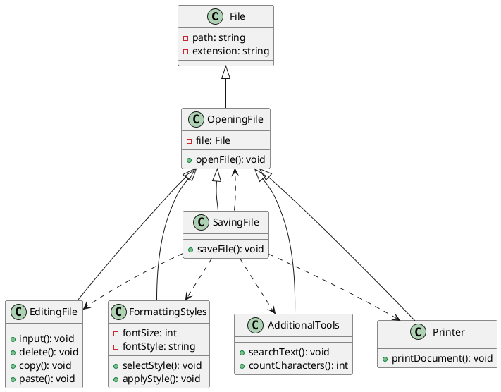

# Диаграмма классов

```plantuml
@startuml
' Base class File
class File {
  -path: string
  -extension: string
}

' OpeningFile inherits from File
class OpeningFile extends File {
  -file: File
  +openFile(): void
}

' Classes inheriting from OpeningFile (as they require an opened file)
class EditingFile extends OpeningFile {
  +input(): void
  +delete(): void
  +copy(): void
  +paste(): void
}

class FormattingStyles extends OpeningFile {
  -fontSize: int
  -fontStyle: string
  +selectStyle(): void
  +applyStyle(): void
}

class AdditionalTools extends OpeningFile {
  +searchText(): void
  +countCharacters(): int
}

class Printer extends OpeningFile {
  +printDocument(): void
}

' SavingFile inherits from OpeningFile but is somewhat independent
' Add dependencies to show saving can happen at each stage
class SavingFile extends OpeningFile {
  +saveFile(): void
}

' Dependencies: SavingFile depends on the other classes (can save at each stage)
SavingFile ..> EditingFile
SavingFile ..> FormattingStyles
SavingFile ..> AdditionalTools
SavingFile ..> Printer
SavingFile ..> OpeningFile
@enduml
```