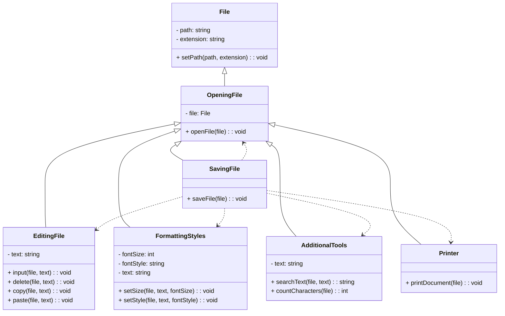

# Диаграмма классов

```mermaid
classDiagram
    class File {
      - path: string
      - extension: string
      + setPath(path, extension): void
    }

    class OpeningFile {
      - file: File
      + openFile(file): void
    }

    class EditingFile {
      - text: string
      + input(file, text): void
      + delete(file, text): void
      + copy(file, text): void
      + paste(file, text): void
    }

    class FormattingStyles {
      - fontSize: int
      - fontStyle: string
      - text: string
      + setSize(file, text, fontSize): void
      + setStyle(file, text, fontStyle): void
    }

    class AdditionalTools {
      - text: string
      + searchText(file, text): string
      + countCharacters(file): int
    }

    class Printer {
      + printDocument(file): void
    }

    class SavingFile {
      + saveFile(file): void
    }

    File <|-- OpeningFile
    OpeningFile <|-- EditingFile
    OpeningFile <|-- FormattingStyles
    OpeningFile <|-- AdditionalTools
    OpeningFile <|-- Printer
    OpeningFile <|-- SavingFile

    SavingFile ..> EditingFile
    SavingFile ..> FormattingStyles
    SavingFile ..> AdditionalTools
    SavingFile ..> Printer
    SavingFile ..> OpeningFile
```