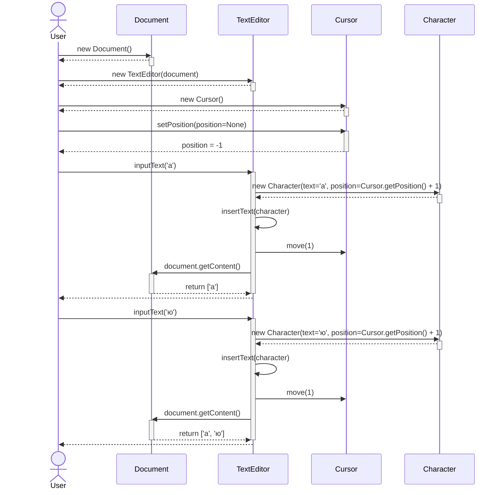

```mermaid
sequenceDiagram
  actor User
  participant Document
  participant TextEditor
  participant Cursor
  participant Character

  User->>Document: new Document()
  activate Document
  Document-->>User: 
  deactivate Document

  User->>TextEditor: new TextEditor(document)
  activate TextEditor
  TextEditor-->>User: 
  deactivate TextEditor

  User->>Cursor: new Cursor()
  activate Cursor
  Cursor-->>User: 
  deactivate Cursor

  User->>Cursor: setPosition(position=None)
  activate Cursor
  Cursor-->>User: position = -1
  deactivate Cursor

  User->>TextEditor: inputText('a')
  activate TextEditor
    TextEditor->>Character: new Character(text='a', position=Cursor.getPosition() + 1)
    activate Character
    Character-->>TextEditor: 
    deactivate Character
    TextEditor->>TextEditor: insertText(character)
    TextEditor->>Cursor: move(1)
    TextEditor->>Document: document.getContent()
    activate Document
    Document-->>TextEditor: return ['a']
    deactivate Document
  deactivate TextEditor
  TextEditor-->>User: 

  User->>TextEditor: inputText('ю')
  activate TextEditor
    TextEditor->>Character: new Character(text='ю', position=Cursor.getPosition() + 1)
    activate Character
    Character-->>TextEditor: 
    deactivate Character
    TextEditor->>TextEditor: insertText(character)
    TextEditor->>Cursor: move(1)
    TextEditor->>Document: document.getContent()
    activate Document
    Document-->>TextEditor: return ['a', 'ю']
    deactivate Document
  deactivate TextEditor
  TextEditor-->>User: 
```