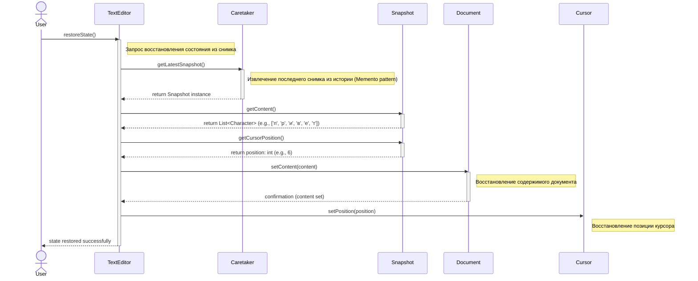

# Диаграмма последовательностей UML: Восстановление файла

```mermaid
sequenceDiagram
    actor User
    participant TextEditor
    participant Caretaker
    participant Snapshot
    participant Document
    participant Cursor

    User ->> TextEditor: restoreState()
    activate TextEditor
    Note right of TextEditor: Запрос восстановления состояния из снимка

    TextEditor ->> Caretaker: getLatestSnapshot()
    activate Caretaker
    Note right of Caretaker: Извлечение последнего снимка из истории (Memento pattern)
    Caretaker -->> TextEditor: return Snapshot instance
    deactivate Caretaker

    TextEditor ->> Snapshot: getContent()
    activate Snapshot
    Snapshot -->> TextEditor: return List<Character> (e.g., ['п', 'р', 'и', 'в', 'е', 'т'])
    deactivate Snapshot

    TextEditor ->> Snapshot: getCursorPosition()
    activate Snapshot
    Snapshot -->> TextEditor: return position: int (e.g., 6)
    deactivate Snapshot

    TextEditor ->> Document: setContent(content)
    activate Document
    Note right of Document: Восстановление содержимого документа
    Document -->> TextEditor: confirmation (content set)
    deactivate Document

    TextEditor ->> Cursor: setPosition(position)
    activate Cursor
    Note right of Cursor: Восстановление позиции курсора

    TextEditor -->> User: state restored successfully
    deactivate TextEditor
```
