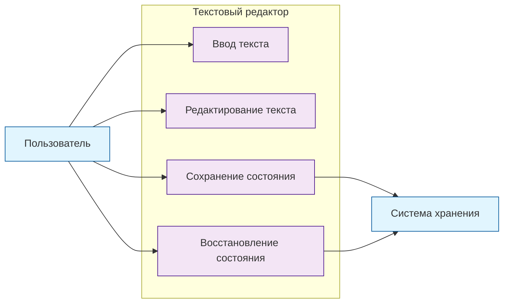

# Диаграмма прецедентов UML для текстового редактора

```mermaid
flowchart LR
    actor1[Пользователь]:::actor
    actor2[Система хранения]:::actor

    subgraph editor[Текстовый редактор]
        UC1[Ввод текста]
        UC2[Редактирование текста]
        UC3[Сохранение состояния]
        UC4[Восстановление состояния]
    end

    actor1 --> UC1
    actor1 --> UC2
    actor1 --> UC3
    actor1 --> UC4
    UC3 --> actor2
    UC4 --> actor2

    classDef actor fill:#e1f5fe,stroke:#01579b
    classDef usecase fill:#f3e5f5,stroke:#4a148c
    class UC1,UC2,UC3,UC4 usecase
    class actor1,actor2 actor
```