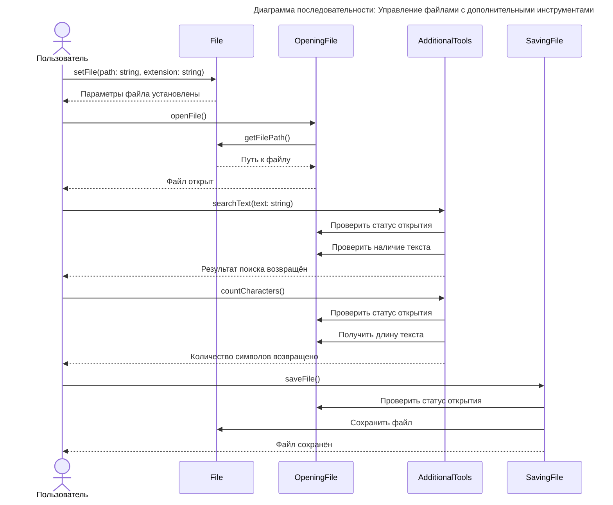

```mermaid
sequenceDiagram
    title Диаграмма последовательности: Управление файлами с дополнительными инструментами
    actor Пользователь
    participant File
    participant OpeningFile
    participant AdditionalTools
    participant SavingFile

    Пользователь ->> File: setFile(path: string, extension: string)
    File -->> Пользователь: Параметры файла установлены

    Пользователь ->> OpeningFile: openFile()
    OpeningFile ->> File: getFilePath()
    File -->> OpeningFile: Путь к файлу
    OpeningFile -->> Пользователь: Файл открыт

    Пользователь ->> AdditionalTools: searchText(text: string)
    AdditionalTools ->> OpeningFile: Проверить статус открытия
    AdditionalTools ->> OpeningFile: Проверить наличие текста
    AdditionalTools -->> Пользователь: Результат поиска возвращён

    Пользователь ->> AdditionalTools: countCharacters()
    AdditionalTools ->> OpeningFile: Проверить статус открытия
    AdditionalTools ->> OpeningFile: Получить длину текста
    AdditionalTools -->> Пользователь: Количество символов возвращено

    Пользователь ->> SavingFile: saveFile()
    SavingFile ->> OpeningFile: Проверить статус открытия
    SavingFile ->> File: Сохранить файл
    SavingFile -->> Пользователь: Файл сохранён
```
