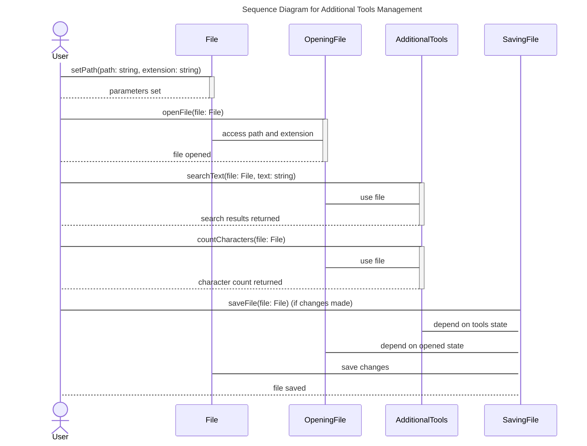

```mermaid
sequenceDiagram
title Sequence Diagram for Additional Tools Management

actor User
participant File
participant OpeningFile
participant AdditionalTools
participant SavingFile

User -> File: setPath(path: string, extension: string)
activate File
File --> User: parameters set
deactivate File

User -> OpeningFile: openFile(file: File)
activate OpeningFile
OpeningFile -> File: access path and extension
OpeningFile --> User: file opened
deactivate OpeningFile

User -> AdditionalTools: searchText(file: File, text: string)
activate AdditionalTools
AdditionalTools -> OpeningFile: use file
AdditionalTools --> User: search results returned
deactivate AdditionalTools

User -> AdditionalTools: countCharacters(file: File)
activate AdditionalTools
AdditionalTools -> OpeningFile: use file
AdditionalTools --> User: character count returned
deactivate AdditionalTools

User -> SavingFile: saveFile(file: File) (if changes made)
activate SavingFile
SavingFile -> AdditionalTools: depend on tools state
SavingFile -> OpeningFile: depend on opened state
	SavingFile -> File: save changes
	SavingFile --> User: file saved
```
