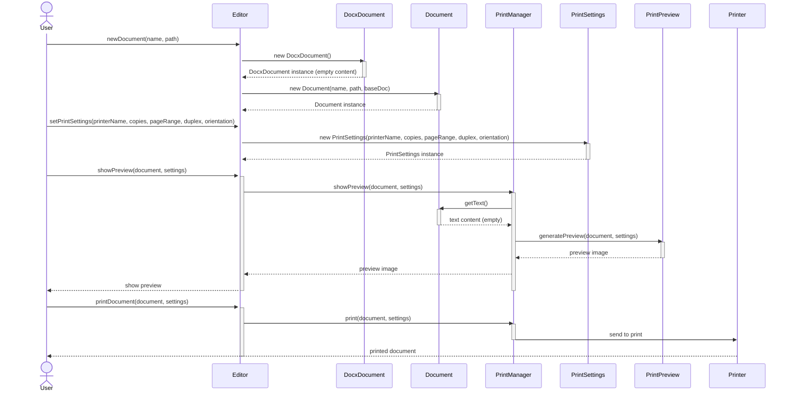

```mermaid
sequenceDiagram
    actor User
    participant Editor
    participant DocxDocument
    participant Document
    participant PrintManager
    participant PrintSettings
    participant PrintPreview

    User->>Editor: newDocument(name, path)
    activate Editor
    Editor->>DocxDocument: new DocxDocument()
    activate DocxDocument
    DocxDocument-->>Editor: DocxDocument instance (empty content)
    deactivate DocxDocument
    Editor->>Document: new Document(name, path, baseDoc)
    activate Document
    Document-->>Editor: Document instance
    deactivate Document

    User->>Editor: setPrintSettings(printerName, copies, pageRange, duplex, orientation)
    Editor->>PrintSettings: new PrintSettings(printerName, copies, pageRange, duplex, orientation)
    activate PrintSettings
    PrintSettings-->>Editor: PrintSettings instance
    deactivate PrintSettings

    User->>Editor: showPreview(document, settings)
    activate Editor
    Editor->>PrintManager: showPreview(document, settings)
    activate PrintManager
    PrintManager->>Document: getText()
    activate Document
    Document-->>PrintManager: text content (empty)
    deactivate Document
    PrintManager->>PrintPreview: generatePreview(document, settings)
    activate PrintPreview
    PrintPreview-->>PrintManager: preview image
    deactivate PrintPreview
    PrintManager-->>Editor: preview image
    Editor-->>User: show preview
    deactivate PrintManager
    deactivate Editor

    User->>Editor: printDocument(document, settings)
    activate Editor
    Editor->>PrintManager: print(document, settings)
    activate PrintManager
    PrintManager->>Printer: send to print
    deactivate PrintManager
    Printer-->>User: printed document
    deactivate Editor
```