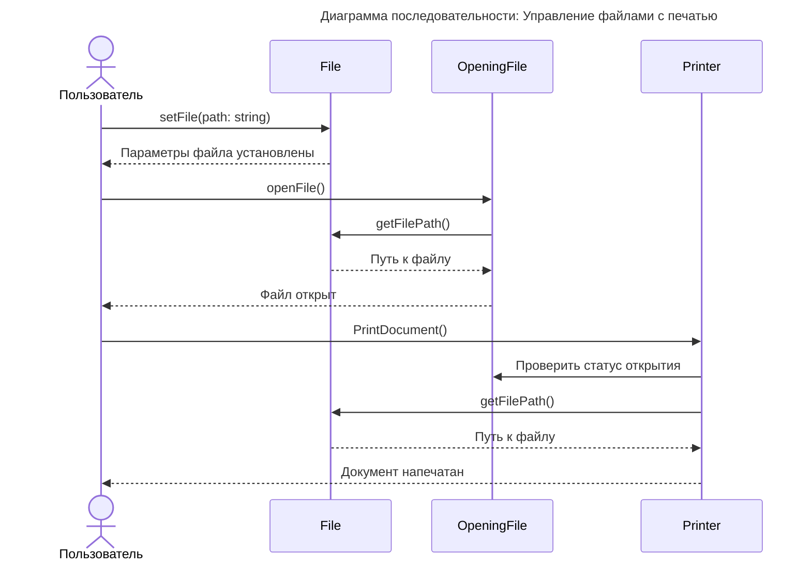

```mermaid
sequenceDiagram
    title Диаграмма последовательности: Управление файлами с печатью
    actor Пользователь
    participant File
    participant OpeningFile
    participant Printer

    Пользователь ->> File: setFile(path: string)
    File -->> Пользователь: Параметры файла установлены

    Пользователь ->> OpeningFile: openFile()
    OpeningFile ->> File: getFilePath()
    File -->> OpeningFile: Путь к файлу
    OpeningFile -->> Пользователь: Файл открыт

    Пользователь ->> Printer: PrintDocument()
    Printer ->> OpeningFile: Проверить статус открытия
    Printer ->> File: getFilePath()
    File -->> Printer: Путь к файлу
    Printer -->> Пользователь: Документ напечатан

```
