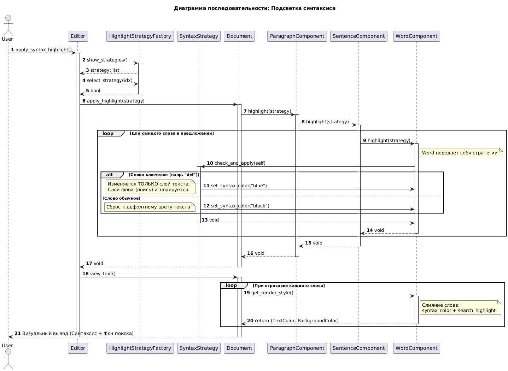

```

@startuml
autonumber
skinparam responseMessageBelowArrow true

actor User
participant "Editor" as Ctrl
participant "HighlightStrategyFactory" as Factory
participant "SyntaxStrategy" as Strategy
participant "Document" as Doc
participant "ParagraphComponent" as Para
participant "SentenceComponent" as Sent
participant "WordComponent" as Word

title Диаграмма последовательности: Подсветка синтаксиса

User -> Ctrl: apply_syntax_highlight()
activate Ctrl

Ctrl -> Factory: show_strategies()
activate Factory
Factory --> Ctrl: strategy: list

Ctrl -> Factory: select_strategy(idx)
Factory --> Ctrl: bool
deactivate Factory

Ctrl -> Doc: apply_highlight(strategy)
activate Doc

Doc -> Para: highlight(strategy)
activate Para

Para -> Sent: highlight(strategy)
activate Sent

loop Для каждого слова в предложении
    Sent -> Word: highlight(strategy)
    activate Word
    
    note right of Word: Word передает себя стратегии
    Word -> Strategy: check_and_apply(self)
    activate Strategy
    
    alt Слово ключевое (напр. "def")
        Strategy -> Word: set_syntax_color("blue")
        note left: Изменяется ТОЛЬКО слой текста.\nСлой фона (поиск) игнорируется.
    else Слово обычное
        Strategy -> Word: set_syntax_color("black")
        note left: Сброс к дефолтному цвету текста
    end
    
    Strategy --> Word: void
    deactivate Strategy
    
    Word --> Sent: void
    deactivate Word
end

Sent --> Para: void
deactivate Sent

Para --> Doc: void
deactivate Para

Doc --> Ctrl: void
deactivate Doc

Ctrl -> Doc: view_text()
activate Doc

loop При отрисовке каждого слова
    Doc -> Word: get_render_style()
    activate Word
    note right of Word: Слияние слоев:\nsyntax_color + search_highlight
    Word --> Doc: return (TextColor, BackgroundColor)
    deactivate Word
end

Doc --> User: Визуальный вывод (Синтаксис + Фон поиска)
deactivate Doc

deactivate Ctrl
@enduml
```
