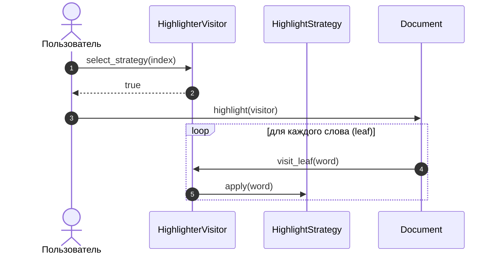

```mermaid
sequenceDiagram
    autonumber
    
    actor User as Пользователь
    participant HV as HighlighterVisitor
    participant HS as HighlightStrategy
    participant Doc as Document

    User->>HV: select_strategy(index)
    HV-->>User: true

    User->>Doc: highlight(visitor)
    
    loop для каждого слова (leaf)
        Doc->>HV: visit_leaf(word)
        HV->>HS: apply(word)
    end
```
