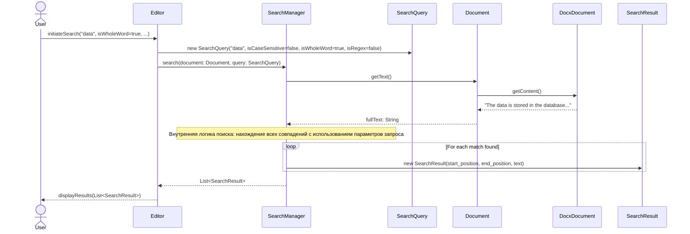

```mermaid
sequenceDiagram
    actor User
    participant Editor
    participant SearchManager
    participant SearchQuery
    participant Document
    participant DocxDocument
    participant SearchResult

    User->>Editor: initiateSearch("data", isWholeWord=true, ...)
    Editor->>SearchQuery: new SearchQuery("data", isCaseSensitive=false, isWholeWord=true, isRegex=false)
    Editor->>SearchManager: search(document: Document, query: SearchQuery)
    
    SearchManager->>Document: getText()
    Document->>DocxDocument: getContent()
    DocxDocument-->>Document: "The data is stored in the database..."
    Document-->>SearchManager: fullText: String
    
    note over SearchManager: Внутренняя логика поиска: нахождение всех совпадений с использованием параметров запроса
    
    loop For each match found
        SearchManager->>SearchResult: new SearchResult(start_position, end_position, text)
    end
    
    SearchManager-->>Editor: List<SearchResult>
    Editor-->>User: displayResults(List<SearchResult>)
```