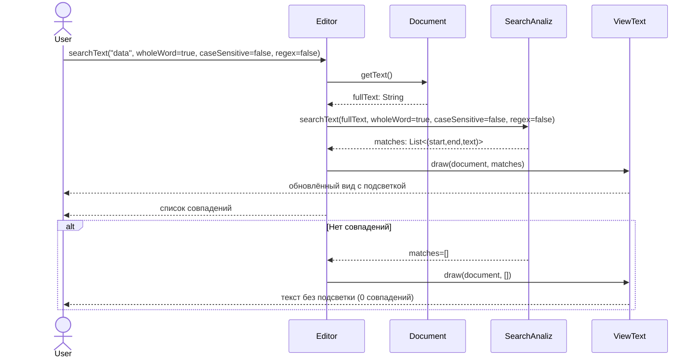

### Диаграмма последовательности для поиска по тексту

```mermaid
sequenceDiagram
    actor User
    participant Editor
    participant Document
    participant SearchAnaliz
    participant ViewText

    User->>Editor: searchText("data", wholeWord=true, caseSensitive=false, regex=false)

    Editor->>Document: getText()
    Document-->>Editor: fullText: String

    Editor->>SearchAnaliz: searchText(fullText, wholeWord=true, caseSensitive=false, regex=false)

    SearchAnaliz-->>Editor: matches: List<(start,end,text)>

    Editor->>ViewText: draw(document, matches)
    ViewText-->>User: обновлённый вид с подсветкой
    Editor-->>User: список совпадений

    alt Нет совпадений
        SearchAnaliz-->>Editor: matches=[]
        Editor->>ViewText: draw(document, [])
        ViewText-->>User: текст без подсветки (0 совпадений)
    end
```