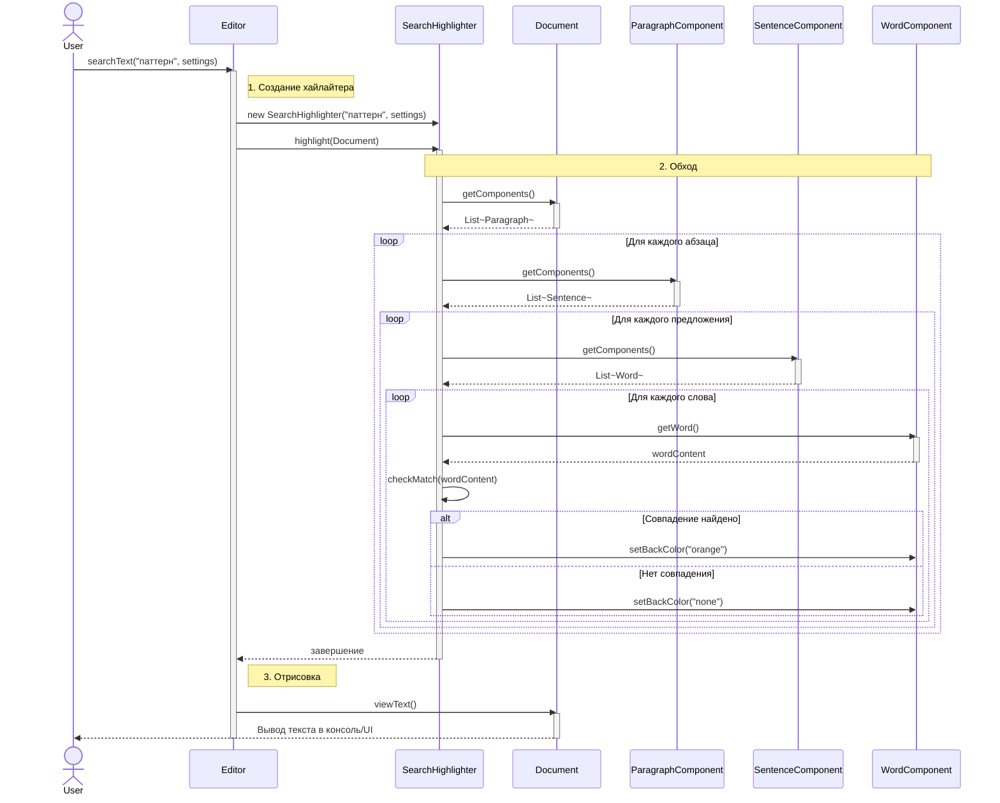

```mermaid
sequenceDiagram
    actor User
    participant Editor
    participant SearchHighlighter
    participant Document
    participant Paragraph as ParagraphComponent
    participant Sentence as SentenceComponent
    participant Word as WordComponent

    User->>Editor: searchText("паттерн", settings)
    activate Editor
    
    Note right of Editor: 1. Создание хайлайтера
    Editor->>SearchHighlighter: new SearchHighlighter("паттерн", settings)
    
    Editor->>SearchHighlighter: highlight(Document)
    activate SearchHighlighter
    
    Note over SearchHighlighter, Word: 2. Обход
    
    SearchHighlighter->>Document: getComponents()
    activate Document
    Document-->>SearchHighlighter: List~Paragraph~
    deactivate Document
    
    loop Для каждого абзаца
        SearchHighlighter->>Paragraph: getComponents()
        activate Paragraph
        Paragraph-->>SearchHighlighter: List~Sentence~
        deactivate Paragraph
        
        loop Для каждого предложения
            SearchHighlighter->>Sentence: getComponents()
            activate Sentence
            Sentence-->>SearchHighlighter: List~Word~
            deactivate Sentence
            
            loop Для каждого слова
                SearchHighlighter->>Word: getWord()
                activate Word
                Word-->>SearchHighlighter: wordContent
                deactivate Word
                
                SearchHighlighter->>SearchHighlighter: checkMatch(wordContent)
                
                alt Совпадение найдено
                    SearchHighlighter->>Word: setBackColor("orange")
                else Нет совпадения
                    SearchHighlighter->>Word: setBackColor("none")
                end
            end
        end
    end
    
    SearchHighlighter-->>Editor: завершение
    deactivate SearchHighlighter
    
    Note right of Editor: 3. Отрисовка
    Editor->>Document: viewText()
    activate Document
    Document-->>User: Вывод текста в консоль/UI
    deactivate Document
    deactivate Editor
```