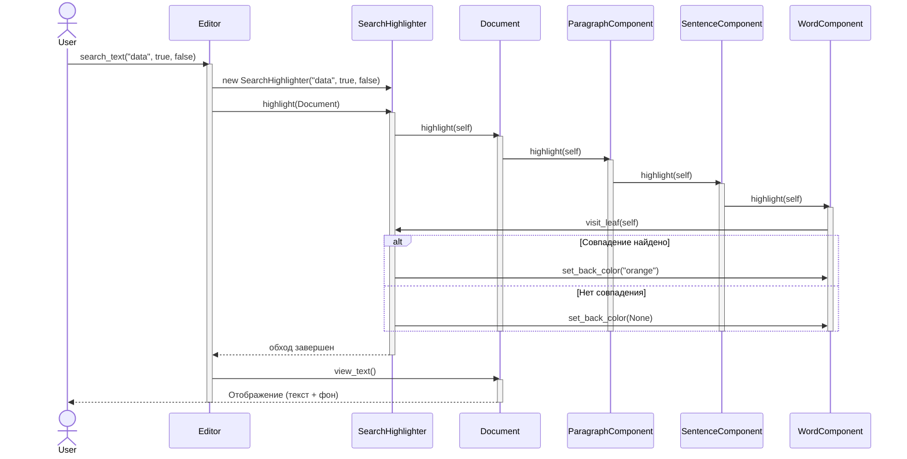

```mermaid
sequenceDiagram
    actor User
    participant Editor
    participant SearchHighlighter
    participant Document
    participant Paragraph as ParagraphComponent
    participant Sentence as SentenceComponent
    participant Word as WordComponent

    User->>Editor: search_text("data", true, false)
    activate Editor
    
    Editor->>SearchHighlighter: new SearchHighlighter("data", true, false)
    
    Editor->>SearchHighlighter: highlight(Document)
    activate SearchHighlighter
    
    SearchHighlighter->>Document: highlight(self)
    activate Document
    
    Document->>Paragraph: highlight(self)
    activate Paragraph
    
    Paragraph->>Sentence: highlight(self)
    activate Sentence
    
    Sentence->>Word: highlight(self)
    activate Word
    
    Word->>SearchHighlighter: visit_leaf(self)
    
    alt Совпадение найдено
        SearchHighlighter->>Word: set_back_color("orange")
    else Нет совпадения
        SearchHighlighter->>Word: set_back_color(None)
    end
    
    deactivate Word
    deactivate Sentence
    deactivate Paragraph
    deactivate Document
    
    SearchHighlighter-->>Editor: обход завершен
    deactivate SearchHighlighter
    
    Editor->>Document: view_text()
    activate Document
    Document-->>User: Отображение (текст + фон)
    deactivate Document
    deactivate Editor
```