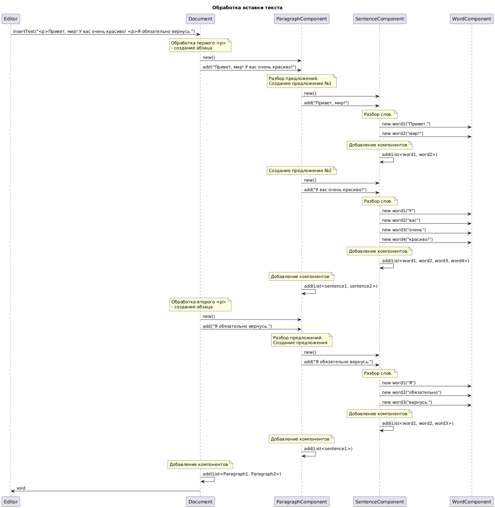

```startuml
@startuml
title Обработка вставки текста

participant Editor
participant Document
participant ParagraphComponent
participant SentenceComponent
participant WordComponent

Editor -> Document: insertText("\\nПривет, мир! У вас очень красиво! \\nЯ обязательно вернусь.")

note over Document
  Обработка первого \\n
  - создание абзаца
end note
Document -> ParagraphComponent: new()
Document -> ParagraphComponent: add("Привет, мир! У вас очень красиво!")

note over ParagraphComponent
  Разбор предложений.
  Создание предложение №1
end note
ParagraphComponent -> SentenceComponent: new()
ParagraphComponent -> SentenceComponent: add("Привет, мир!")

note over SentenceComponent
  Разбор слов.
end note
SentenceComponent -> WordComponent: new word1("Привет,")
SentenceComponent -> WordComponent: new word2("мир!")

note over SentenceComponent
  Добавление компонентов
end note
SentenceComponent -> SentenceComponent: add(List<word1, word2>)

note over ParagraphComponent
  Создание предложение №2
end note
ParagraphComponent -> SentenceComponent: new()
ParagraphComponent -> SentenceComponent: add("У вас очень красиво!")

note over SentenceComponent
  Разбор слов.
end note
SentenceComponent -> WordComponent: new word1("У")
SentenceComponent -> WordComponent: new word2("вас")
SentenceComponent -> WordComponent: new word3("очень")
SentenceComponent -> WordComponent: new word4("красиво!")

note over SentenceComponent
  Добавление компонентов
end note
SentenceComponent -> SentenceComponent: add(List<word1, word2, word3, word4>)

note over ParagraphComponent
  Добавление компонентов
end note
ParagraphComponent -> ParagraphComponent: add(List<sentence1, sentence2>)

note over Document
  Обработка второго \\n
  - создание абзаца
end note
Document -> ParagraphComponent: new()
Document -> ParagraphComponent: add("Я обязательно вернусь.")

note over ParagraphComponent
  Разбор предложений.
  Создание предложения
end note
ParagraphComponent -> SentenceComponent: new()
ParagraphComponent -> SentenceComponent: add("Я обязательно вернусь.")

note over SentenceComponent
  Разбор слов.
end note
SentenceComponent -> WordComponent: new word1("Я")
SentenceComponent -> WordComponent: new word2("обязательно")
SentenceComponent -> WordComponent: new word3("вернусь.")

note over SentenceComponent
  Добавление компонентов
end note
SentenceComponent -> SentenceComponent: add(List<word1, word2, word3>)

note over ParagraphComponent
  Добавление компонентов
end note
ParagraphComponent -> ParagraphComponent: add(List<sentence1>)

note over Document
  Добавление компонентов
end note
Document -> Document: add(List<Paragraph1, Paragraph2>)
@enduml
```
