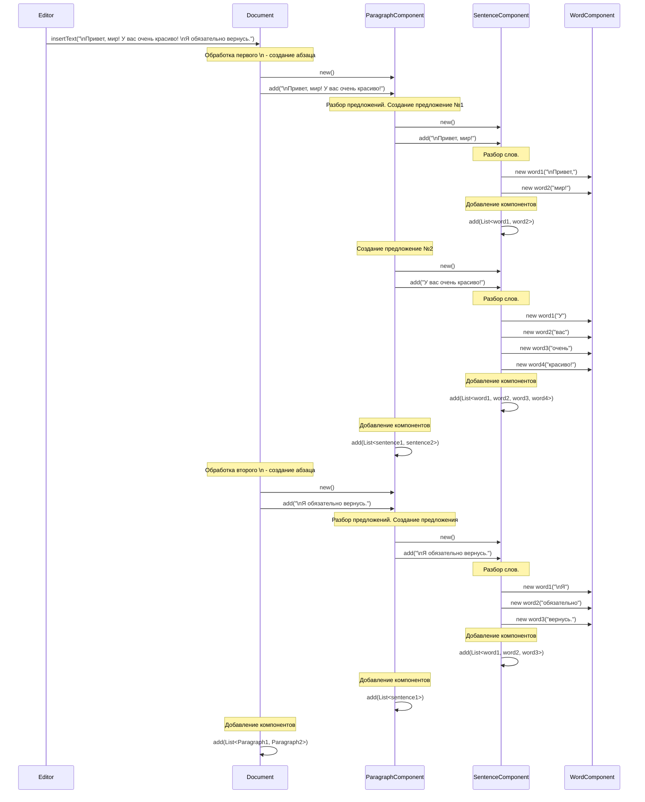

# Диаграмма последовательностей для редактировования текста

```mermaid
sequenceDiagram
    participant Editor
    participant Document
    participant ParagraphComponent
    participant SentenceComponent
    participant WordComponent

    Editor->>Document: insertText("\nПривет, мир! У вас очень красиво! \nЯ обязательно вернусь.")
    
    
    Note over Document: Обработка первого \n - создание абзаца
    Document->>ParagraphComponent: new()
    Document->>ParagraphComponent: add("\nПривет, мир! У вас очень красиво!")
    
    Note over ParagraphComponent: Разбор предложений. Создание предложение №1
    ParagraphComponent->>SentenceComponent: new()
    ParagraphComponent->>SentenceComponent:add("\nПривет, мир!")
    
    Note over SentenceComponent: Разбор слов.
    SentenceComponent->>WordComponent: new word1("\nПривет,")
    SentenceComponent->>WordComponent: new word2("мир!")

    Note over SentenceComponent: Добавление компонентов
    SentenceComponent->>SentenceComponent: add(List<word1, word2>)

    Note over ParagraphComponent: Создание предложение №2
    ParagraphComponent->>SentenceComponent: new()
    ParagraphComponent->>SentenceComponent:add("У вас очень красиво!")
    
    Note over SentenceComponent: Разбор слов.
    SentenceComponent->>WordComponent: new word1("У")
    SentenceComponent->>WordComponent: new word2("вас")
    SentenceComponent->>WordComponent: new word3("очень")
    SentenceComponent->>WordComponent: new word4("красиво!")

    Note over SentenceComponent: Добавление компонентов
    SentenceComponent->>SentenceComponent: add(List<word1, word2, word3, word4>)

    Note over ParagraphComponent: Добавление компонентов
    ParagraphComponent->>ParagraphComponent: add(List<sentence1, sentence2>)

    Note over Document: Обработка второго \n - создание абзаца
    Document->>ParagraphComponent: new()
    Document->>ParagraphComponent: add("\nЯ обязательно вернусь.")
    
    Note over ParagraphComponent: Разбор предложений. Создание предложения
    ParagraphComponent->>SentenceComponent: new()
    ParagraphComponent->>SentenceComponent:add("\nЯ обязательно вернусь.")
    
    Note over SentenceComponent: Разбор слов.
    SentenceComponent->>WordComponent: new word1("\nЯ")
    SentenceComponent->>WordComponent: new word2("обязательно")
    SentenceComponent->>WordComponent: new word3("вернусь.")

    Note over SentenceComponent: Добавление компонентов
    SentenceComponent->>SentenceComponent: add(List<word1, word2, word3>)

    Note over ParagraphComponent: Добавление компонентов
    ParagraphComponent->>ParagraphComponent: add(List<sentence1>)

    Note over Document: Добавление компонентов
    Document->>Document: add(List<Paragraph1, Paragraph2>)
```
