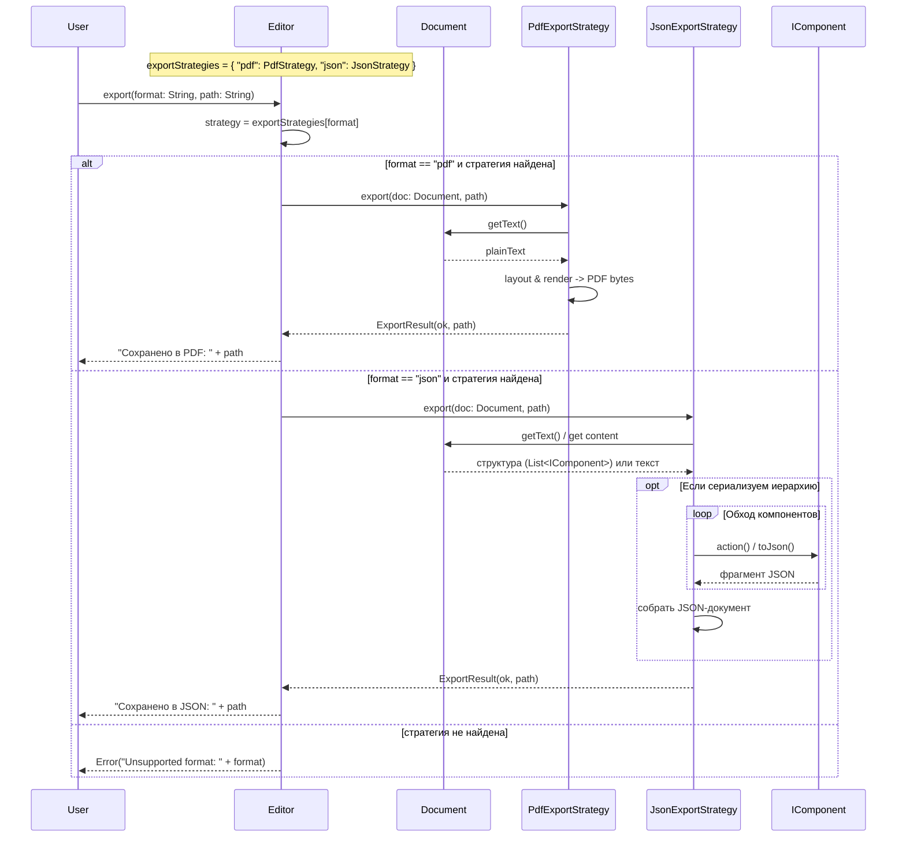

```mermaid
sequenceDiagram
    participant User
    participant Editor
    participant Document
    participant PdfStrategy as PdfExportStrategy
    participant JsonStrategy as JsonExportStrategy
    participant IComp as IComponent

    Note over Editor: exportStrategies = { "pdf": PdfStrategy, "json": JsonStrategy }

    User->>Editor: export(format: String, path: String)
    Editor->>Editor: strategy = exportStrategies[format]

    alt format == "pdf" и стратегия найдена
        Editor->>PdfStrategy: export(doc: Document, path)
        PdfStrategy->>Document: getText()
        Document-->>PdfStrategy: plainText
        PdfStrategy->>PdfStrategy: layout & render -> PDF bytes
        PdfStrategy-->>Editor: ExportResult(ok, path)
        Editor-->>User: "Сохранено в PDF: " + path
    else format == "json" и стратегия найдена
        Editor->>JsonStrategy: export(doc: Document, path)
        JsonStrategy->>Document: getText() / get content
        Document-->>JsonStrategy: структура (List<IComponent>) или текст
        opt Если сериализуем иерархию
            loop Обход компонентов
                JsonStrategy->>IComp: action() / toJson()
                IComp-->>JsonStrategy: фрагмент JSON 
            end
            JsonStrategy->>JsonStrategy: собрать JSON-документ
        end
        JsonStrategy-->>Editor: ExportResult(ok, path)
        Editor-->>User: "Сохранено в JSON: " + path
    else стратегия не найдена
        Editor-->>User: Error("Unsupported format: " + format)
    end
```