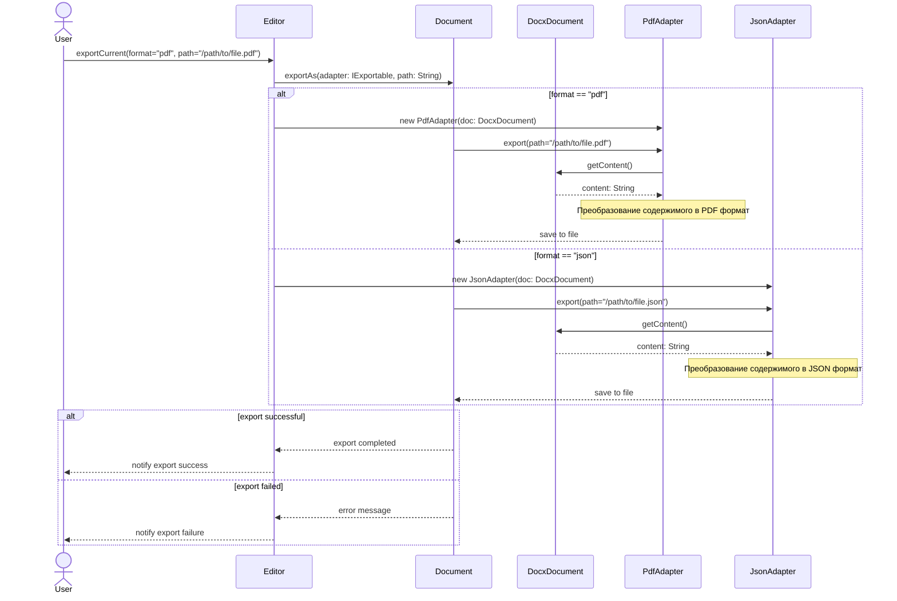

```mermaid
sequenceDiagram
    actor User
    participant Editor
    participant Document
    participant DocxDocument
    participant PdfAdapter
    participant JsonAdapter

    User->>Editor: exportCurrent(format="pdf", path="/path/to/file.pdf")
    Editor->>Document: exportAs(adapter: IExportable, path: String)

    alt format == "pdf"
        Editor->>PdfAdapter: new PdfAdapter(doc: DocxDocument)
        Document->>PdfAdapter: export(path="/path/to/file.pdf")
        PdfAdapter->>DocxDocument: getContent()
        DocxDocument-->>PdfAdapter: content: String
        note over PdfAdapter: Преобразование содержимого в PDF формат
        PdfAdapter-->>Document: save to file
    else format == "json"
        Editor->>JsonAdapter: new JsonAdapter(doc: DocxDocument)
        Document->>JsonAdapter: export(path="/path/to/file.json")
        JsonAdapter->>DocxDocument: getContent()
        DocxDocument-->>JsonAdapter: content: String
        note over JsonAdapter: Преобразование содержимого в JSON формат
        JsonAdapter-->>Document: save to file
    end

    alt export successful
        Document-->>Editor: export completed
        Editor-->>User: notify export success
    else export failed
        Document-->>Editor: error message
        Editor-->>User: notify export failure
    end
```