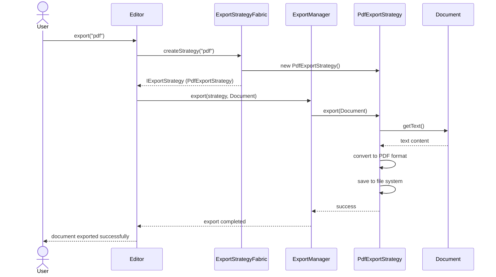

```mermaid
sequenceDiagram
    actor User
    participant Editor
    participant ExportStrategyFabric
    participant ExportManager
    participant PdfExportStrategy
    participant Document

    User->>Editor: export("pdf")
    
    Editor->>ExportStrategyFabric: createStrategy("pdf")
    ExportStrategyFabric->>PdfExportStrategy: new PdfExportStrategy()
    ExportStrategyFabric-->>Editor: IExportStrategy (PdfExportStrategy)
    
    
    Editor->>ExportManager: export(strategy, Document)
    ExportManager->>PdfExportStrategy: export(Document)
    
    PdfExportStrategy->>Document: getText()
    Document-->>PdfExportStrategy: text content
    
    PdfExportStrategy->>PdfExportStrategy: convert to PDF format
    PdfExportStrategy->>PdfExportStrategy: save to file system
    
    PdfExportStrategy-->>ExportManager: success
    ExportManager-->>Editor: export completed
    Editor-->>User: document exported successfully
```