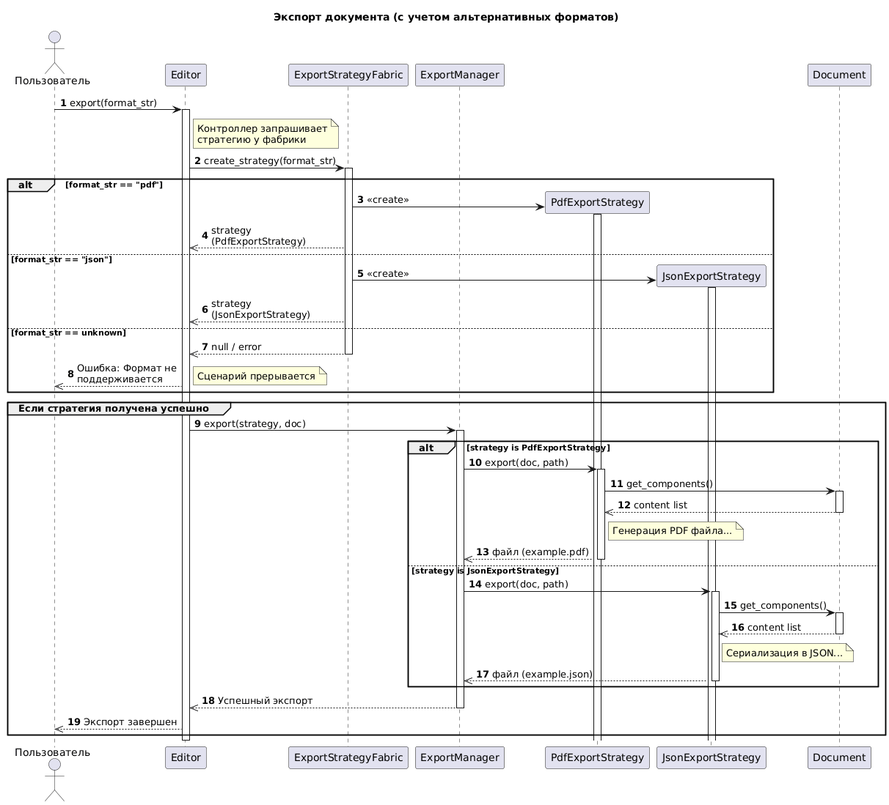

```startuml
@startuml
autonumber
skinparam responseMessageBelowArrow true
skinparam maxMessageSize 150

actor "Пользователь" as U
participant "Editor" as E
participant "ExportStrategyFabric" as EF
participant "ExportManager" as EM
participant "PdfExportStrategy" as PDF
participant "JsonExportStrategy" as JSON
participant "Document" as D

title Экспорт документа (с учетом альтернативных форматов)

U -> E: export(format_str)
activate E

note right of E: Контроллер запрашивает\nстратегию у фабрики

E -> EF: create_strategy(format_str)
activate EF

' БЛОК 1: Альтернативы создания стратегии
alt format_str == "pdf"
    create PDF
    EF -> PDF: <<create>>
    activate PDF
    deactivate PDF
    EF -->> E: strategy (PdfExportStrategy)

else format_str == "json"
    create JSON
    EF -> JSON: <<create>>
    activate JSON
    deactivate JSON
    EF -->> E: strategy (JsonExportStrategy)

else format_str == unknown
    EF -->> E: null / error
    deactivate EF
    
    E -->> U: Ошибка: Формат не поддерживается
    note right: Сценарий прерывается
end

' БЛОК 2: Использование стратегии (если она создана)
group Если стратегия получена успешно
    E -> EM: export(strategy, doc)
    activate EM
    
    alt strategy is PdfExportStrategy
        EM -> PDF: export(doc, path)
        activate PDF
        
        PDF -> D: get_components()
        activate D
        D -->> PDF: content list
        deactivate D
        
        note right of PDF: Генерация PDF файла...
        PDF -->> EM: файл (example.pdf)
        deactivate PDF

    else strategy is JsonExportStrategy
        EM -> JSON: export(doc, path)
        activate JSON
        
        JSON -> D: get_components()
        activate D
        D -->> JSON: content list
        deactivate D
        
        note right of JSON: Сериализация в JSON...
        JSON -->> EM: файл (example.json)
        deactivate JSON
    end

    EM -->> E: Успешный экспорт
    deactivate EM

    E -->> U: Экспорт завершен
end

deactivate E
@enduml
```