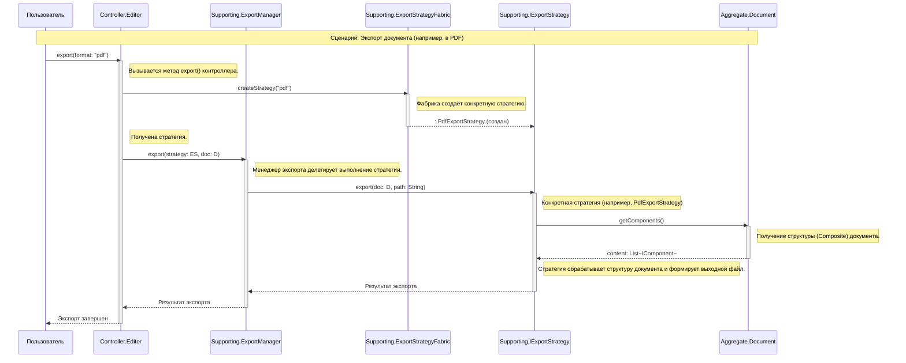

```mermaid
sequenceDiagram
    participant U as Пользователь
    participant E as Controller.Editor
    participant EM as Supporting.ExportManager
    participant EF as Supporting.ExportStrategyFabric
    participant ES as Supporting.IExportStrategy
    participant D as Aggregate.Document

    Note over U,D: Сценарий: Экспорт документа (например, в PDF)

    U->>E: export(format: "pdf")
    activate E
    Note right of E: Вызывается метод export() контроллера.

    E->>EF: createStrategy("pdf")
    activate EF
    Note right of EF: Фабрика создаёт конкретную стратегию.

    EF-->>ES: : PdfExportStrategy (создан)
    deactivate EF
    Note right of E: Получена стратегия.

    E->>EM: export(strategy: ES, doc: D)
    activate EM
    Note right of EM: Менеджер экспорта делегирует выполнение стратегии.

    EM->>ES: export(doc: D, path: String)
    activate ES
    Note right of ES: Конкретная стратегия (например, PdfExportStrategy)
    
    ES->>D: getComponents()
    activate D
    Note right of D: Получение структуры (Composite) документа.

    D-->>ES: content: List~IComponent~
    deactivate D
    
    Note right of ES: Стратегия обрабатывает структуру документа и формирует выходной файл.
    
    ES-->>EM: Результат экспорта
    deactivate ES

    EM-->>E: Результат экспорта
    deactivate EM

    E-->>U: Экспорт завершен
    deactivate E
```