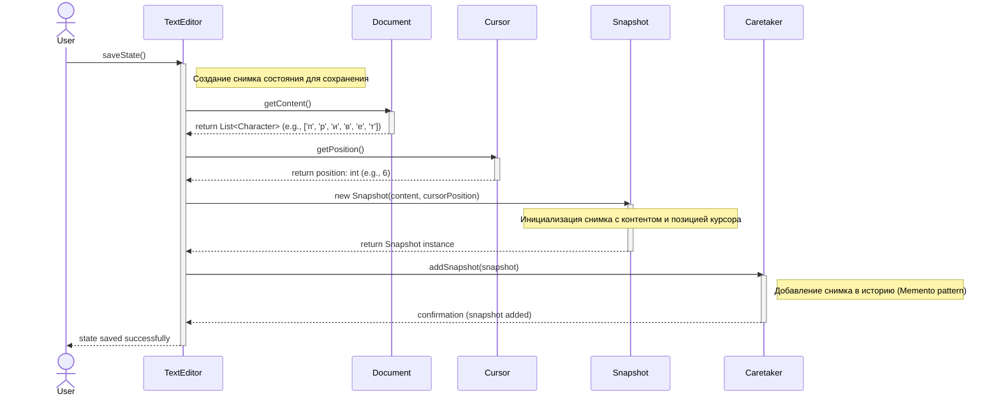

# Диаграмма последовательностей UML: Сохранение файла

```mermaid
sequenceDiagram
    actor User
    participant TextEditor
    participant Document
    participant Cursor
    participant Snapshot
    participant Caretaker

    User ->> TextEditor: saveState()
    activate TextEditor
    Note right of TextEditor: Создание снимка состояния для сохранения

    TextEditor ->> Document: getContent()
    activate Document
    Document -->> TextEditor: return List<Character> (e.g., ['п', 'р', 'и', 'в', 'е', 'т'])
    deactivate Document

    TextEditor ->> Cursor: getPosition()
    activate Cursor
    Cursor -->> TextEditor: return position: int (e.g., 6)
    deactivate Cursor

    TextEditor ->> Snapshot: new Snapshot(content, cursorPosition)
    activate Snapshot
    Note over Snapshot: Инициализация снимка с контентом и позицией курсора
    Snapshot -->> TextEditor: return Snapshot instance
    deactivate Snapshot

    TextEditor ->> Caretaker: addSnapshot(snapshot)
    activate Caretaker
    Note right of Caretaker: Добавление снимка в историю (Memento pattern)
    Caretaker -->> TextEditor: confirmation (snapshot added)
    deactivate Caretaker

    TextEditor -->> User: state saved successfully
    deactivate TextEditor
```
