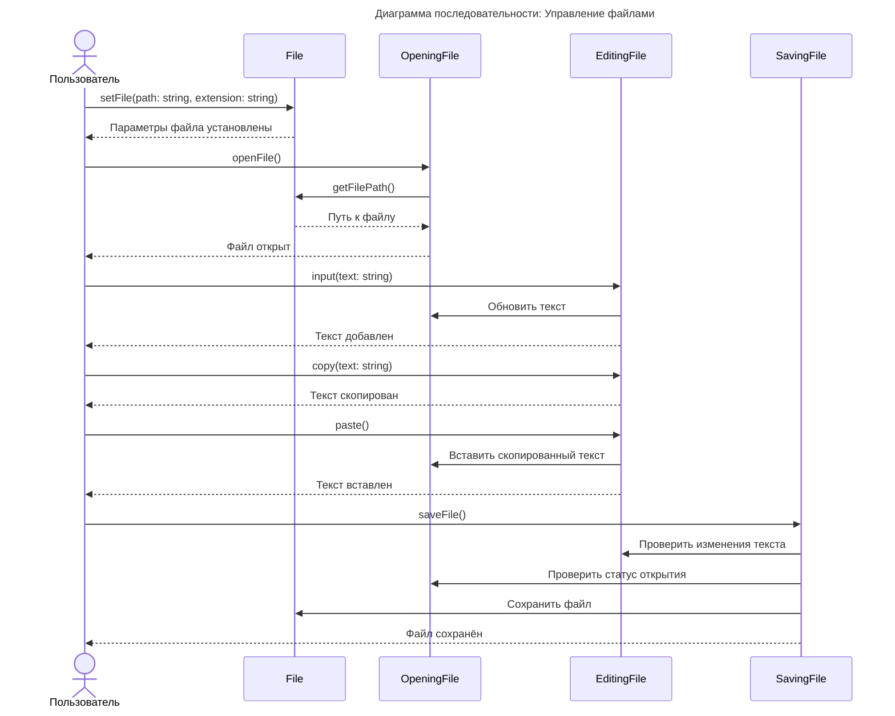

```mermaid
sequenceDiagram
    title Диаграмма последовательности: Управление файлами
    actor Пользователь
    participant File
    participant OpeningFile
    participant EditingFile
    participant SavingFile

    Пользователь ->> File: setFile(path: string, extension: string)
    File -->> Пользователь: Параметры файла установлены

    Пользователь ->> OpeningFile: openFile()
    OpeningFile ->> File: getFilePath()
    File -->> OpeningFile: Путь к файлу
    OpeningFile -->> Пользователь: Файл открыт

    Пользователь ->> EditingFile: input(text: string)
    EditingFile ->> OpeningFile: Обновить текст
    EditingFile -->> Пользователь: Текст добавлен

    Пользователь ->> EditingFile: copy(text: string)
    EditingFile -->> Пользователь: Текст скопирован

    Пользователь ->> EditingFile: paste()
    EditingFile ->> OpeningFile: Вставить скопированный текст
    EditingFile -->> Пользователь: Текст вставлен

    Пользователь ->> SavingFile: saveFile()
    SavingFile ->> EditingFile: Проверить изменения текста
    SavingFile ->> OpeningFile: Проверить статус открытия
    SavingFile ->> File: Сохранить файл
    SavingFile -->> Пользователь: Файл сохранён
```