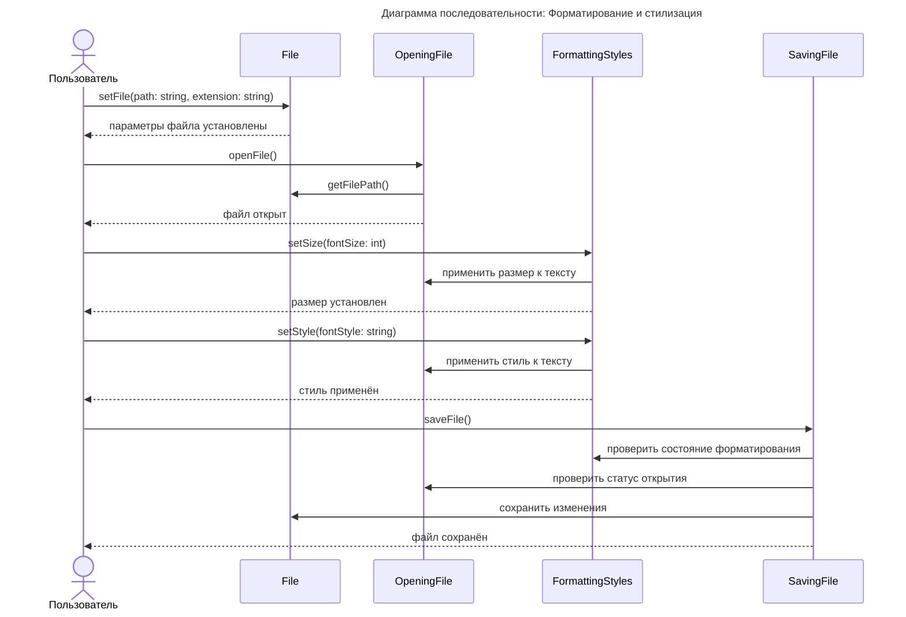

# Форматирование и стилизация

```mermaid
sequenceDiagram
    title Диаграмма последовательности: Форматирование и стилизация
    actor Пользователь
    participant File
    participant OpeningFile
    participant FormattingStyles
    participant SavingFile

    Пользователь ->> File: setFile(path: string, extension: string)
    File -->> Пользователь: параметры файла установлены

    Пользователь ->> OpeningFile: openFile()
    OpeningFile ->> File: getFilePath()
    OpeningFile -->> Пользователь: файл открыт

    Пользователь ->> FormattingStyles: setSize(fontSize: int)
    FormattingStyles ->> OpeningFile: применить размер к тексту
    FormattingStyles -->> Пользователь: размер установлен

    Пользователь ->> FormattingStyles: setStyle(fontStyle: string)
    FormattingStyles ->> OpeningFile: применить стиль к тексту
    FormattingStyles -->> Пользователь: стиль применён

    Пользователь ->> SavingFile: saveFile()
    SavingFile ->> FormattingStyles: проверить состояние форматирования
    SavingFile ->> OpeningFile: проверить статус открытия
    SavingFile ->> File: сохранить изменения
    SavingFile -->> Пользователь: файл сохранён
```