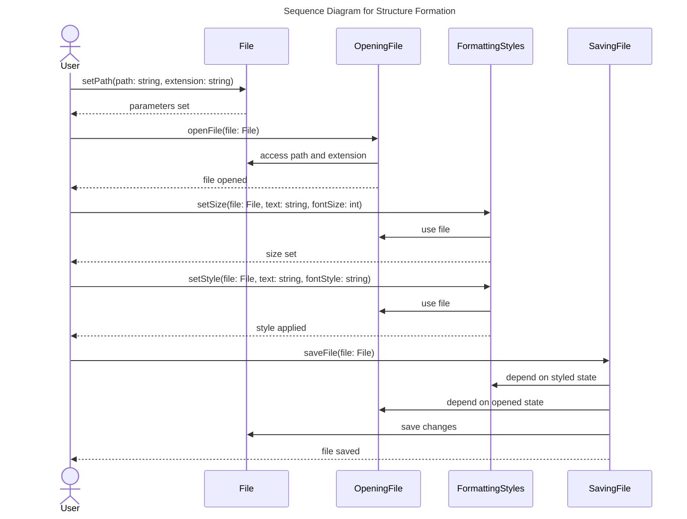

# Форматирование и стилизация

```mermaid
sequenceDiagram
    title Sequence Diagram for Structure Formation
    actor User
    participant File
    participant OpeningFile
    participant FormattingStyles
    participant SavingFile

    User ->> File: setPath(path: string, extension: string)
    File -->> User: parameters set

    User ->> OpeningFile: openFile(file: File)
    OpeningFile ->> File: access path and extension
    OpeningFile -->> User: file opened

    User ->> FormattingStyles: setSize(file: File, text: string, fontSize: int)
    FormattingStyles ->> OpeningFile: use file
    FormattingStyles -->> User: size set

    User ->> FormattingStyles: setStyle(file: File, text: string, fontStyle: string)
    FormattingStyles ->> OpeningFile: use file
    FormattingStyles -->> User: style applied

    User ->> SavingFile: saveFile(file: File)
    SavingFile ->> FormattingStyles: depend on styled state
    SavingFile ->> OpeningFile: depend on opened state
    SavingFile ->> File: save changes
    SavingFile -->> User: file saved
```