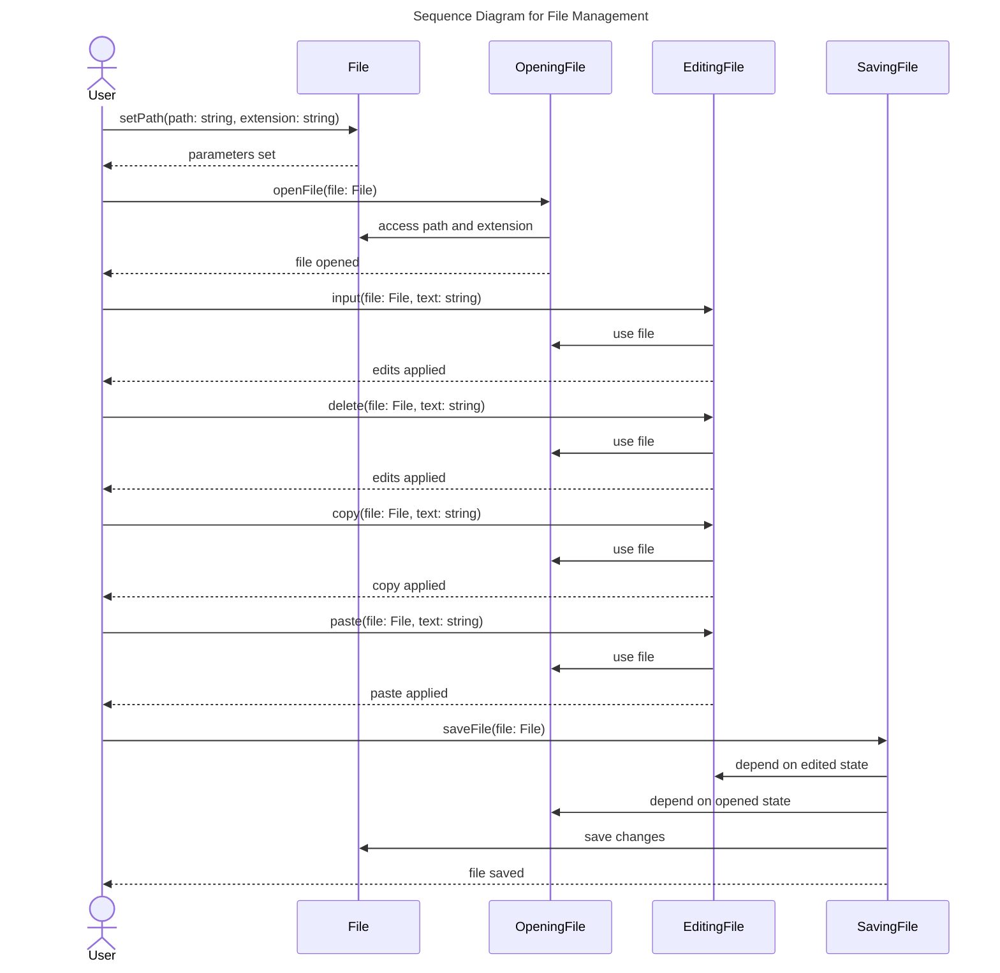

```mermaid
sequenceDiagram
    title Sequence Diagram for File Management
    actor User
    participant File
    participant OpeningFile
    participant EditingFile
    participant SavingFile

    User ->> File: setPath(path: string, extension: string)
    File -->> User: parameters set

    User ->> OpeningFile: openFile(file: File)
    OpeningFile ->> File: access path and extension
    OpeningFile -->> User: file opened

    User ->> EditingFile: input(file: File, text: string)
    EditingFile ->> OpeningFile: use file
    EditingFile -->> User: edits applied

    User ->> EditingFile: delete(file: File, text: string)
    EditingFile ->> OpeningFile: use file
    EditingFile -->> User: edits applied

    User ->> EditingFile: copy(file: File, text: string)
    EditingFile ->> OpeningFile: use file
    EditingFile -->> User: copy applied

    User ->> EditingFile: paste(file: File, text: string)
    EditingFile ->> OpeningFile: use file
    EditingFile -->> User: paste applied

    User ->> SavingFile: saveFile(file: File)
    SavingFile ->> EditingFile: depend on edited state
    SavingFile ->> OpeningFile: depend on opened state
    SavingFile ->> File: save changes
    SavingFile -->> User: file saved
```